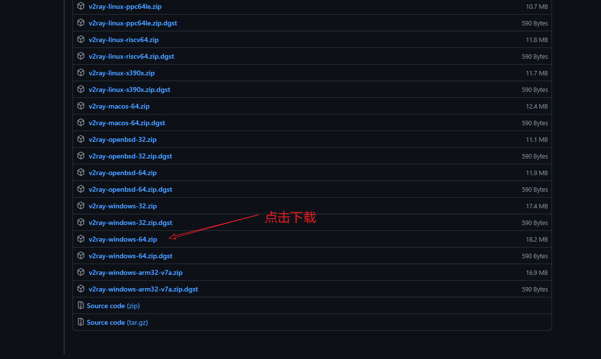

下面内容基于Windows10环境实践。

内容中的所有文件都在盘里面，需要的自行提取。

链接：https://pan.baidu.com/s/1nEVTmVBNQsszCh3l463-kg 
提取码：myu1 

---

## 1.安装Qv2ray

这里的版本是2.6.3，直接到github.com搜索qv2ray ，第一个仓库就是了。

下载成功之后，一直下一步、下一步傻瓜式安装就行了。

程序运行成功之后的界面效果：

查看版本：

## 2.安装v2ray内核

直接进入github的下载页面进行下载：<https://github.com/v2fly/v2ray-core/releases/tag/v4.31.0>

下载之后是一个压缩包，直接进行解压操作，得到下面的目录。

这个目录里面的 `v2ray.exe`后面要作为内核设置中的`V2Ray核心可执行文件路径`被使用。

这个V2Ray资源目录就是核心可执行文件的上一级目录。

## 3.配置trojan插件

因为Qv2ray这个软件支持弹性拓展，你想让它支持什么协议就安装什么协议的插件即可，这里我们需要安装trojan插件。

trojan插件下载地址：<https://github.com/Qv2ray/QvPlugin-Trojan/releases>

这里需要注意插件版本的问题，这个教程里面的Qv2ray是2.6.3的版本，那么trojan插件的版本应该选择2.0正式版。

不要选择3.0的版本，会出现问题。

下载好对应的文件之后，进入Qv2ray，然后点击`插件`，点击`打开本地插件目录`，把刚才下载的插件复制到这个目录，重启Qv2ray软件即可。

## 4.连接trojan

然后点击导入，然后连接。

有时候可能会出现连接了但是还不能上网，重启下软件或者右键软件图标点击重新连接就ok。

没有问题的话，打开浏览器就能看到期待的画面了。

然后，你懂得 : )

